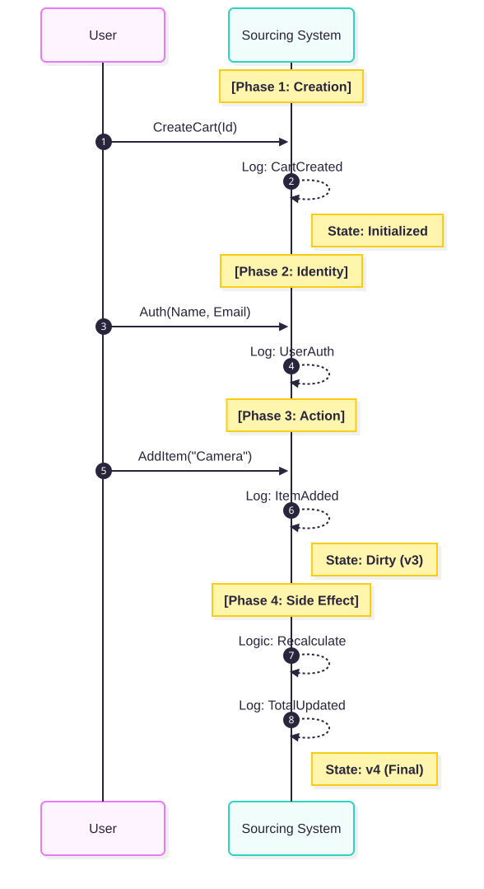
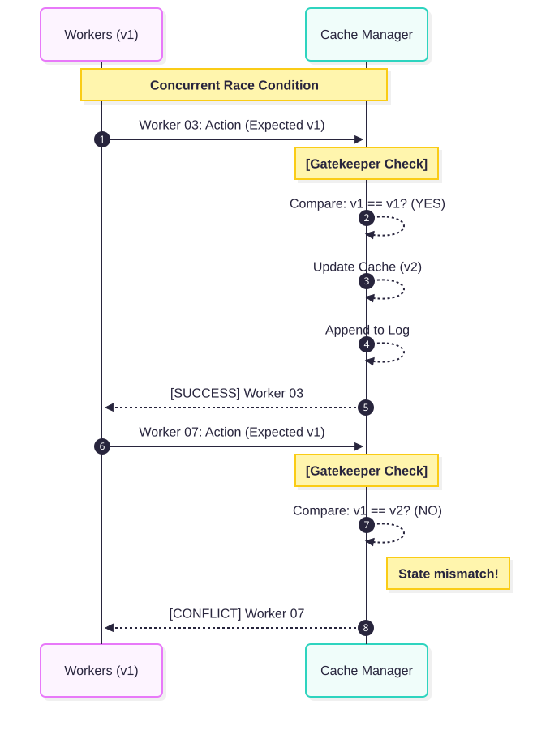
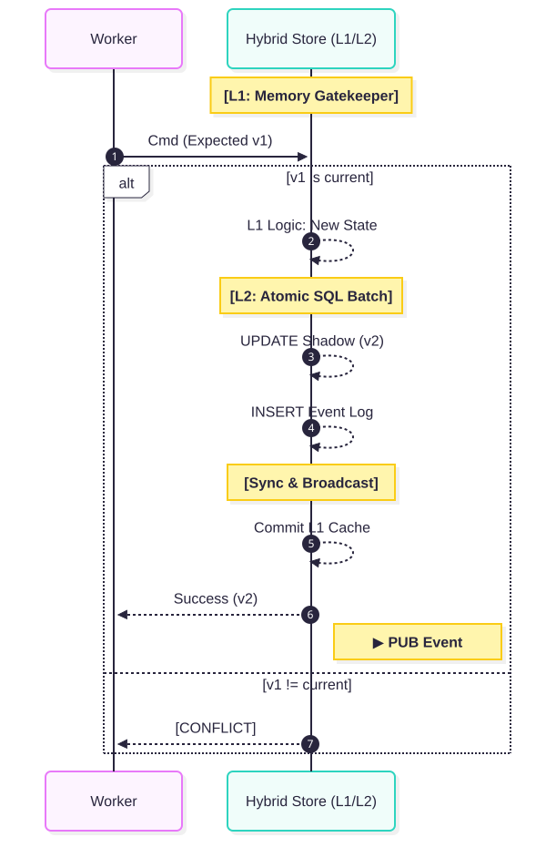
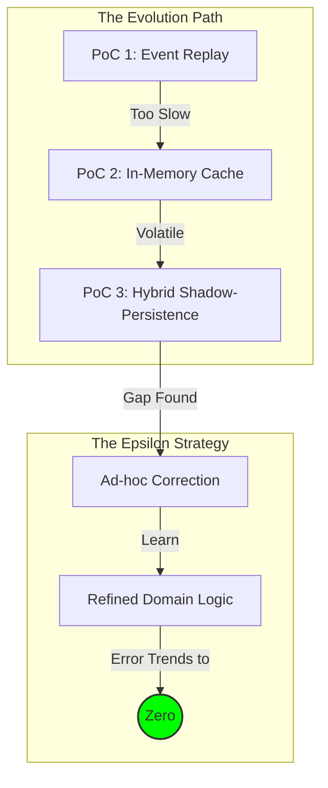
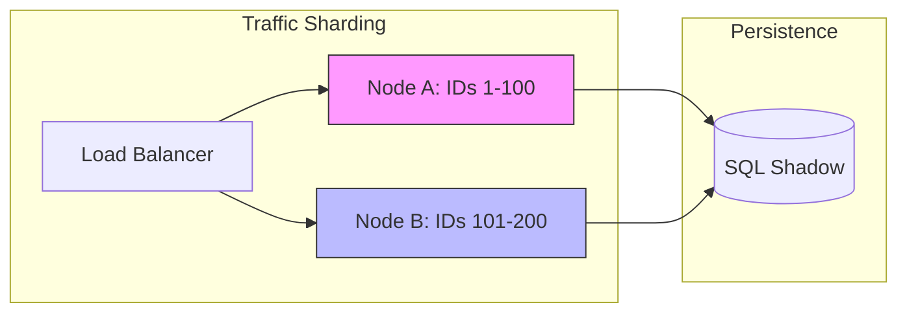
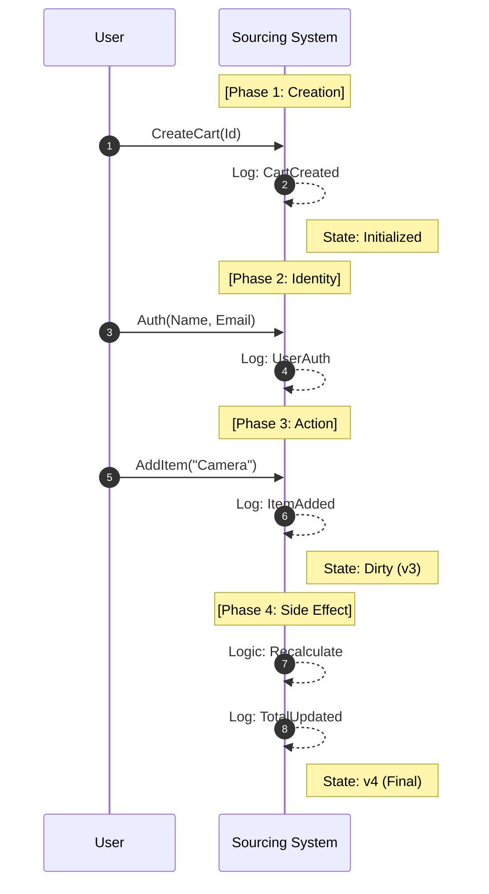
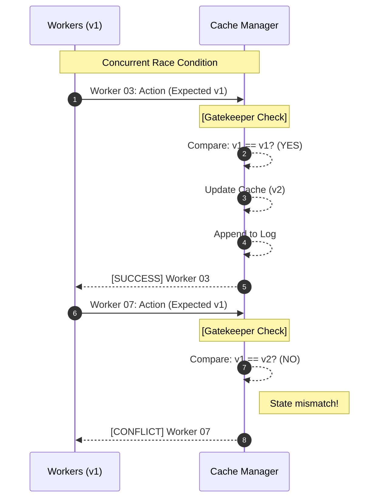
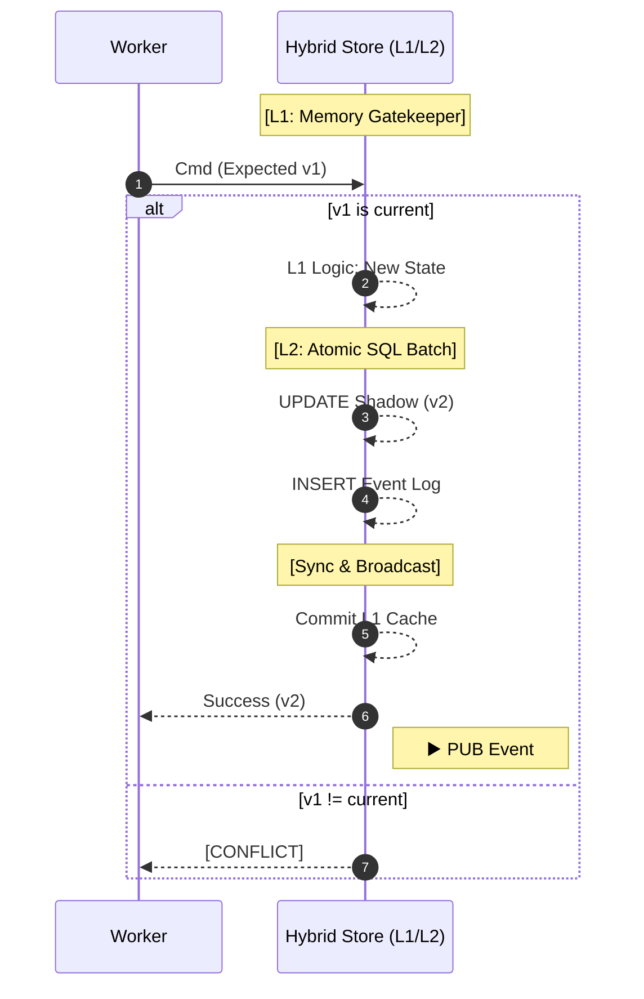

# SyncSourcing Core: High-Performance Architectural Evolution

This repository demonstrates a logical progression from traditional **Event Sourcing** to a high-performance, sharding-ready model called **"Sync-Sourcing."**

## 🏆 Portfolio Summary: The Hybrid Shadow-Persistence Model
This project explores a solution for high-scale systems where "Replay Latency" is a bottleneck. By treating an **In-Memory Cache (L1)** as the primary Gatekeeper for concurrency and a **Database (L2)** as a persistent Shadow, we achieve sub-millisecond validation with 100% data durability.

### Key Innovations:
* **Hybrid Gatekeeping:** Concurrency is managed in L1 memory, while L2 handles persistent "Shadowing."
* **D-Sharding Architecture:** The design supports horizontal scaling by allowing different nodes or threads to own specific ID-shards in memory.
* **Update-First Batch Sourcing:** Minimizes database overhead by prioritizing `UPDATE` operations over `INSERT`. Using the `changes()` logic, we sync state and log simultaneously in a single atomic SQL roundtrip.
* **The Epsilon Strategy:** A pragmatic approach acknowledging that domain maturity is a journey. The cache-first model allows for "Ad-hoc Corrections," treating modeling gaps as an error epsilon that trends toward zero. This creates a feedback loop ideal for future **Machine Learning** optimization.

---

## 📦 The 3 Stages of Evolution

### 1. PoC 1: Basic Event Sourcing
* **Strategy:** Replay history to build state ($O(n)$).
* **Focus:** Establishing a lean event schema and separating business data from traceability metadata.

### 2. PoC 2: Synced Cache Sourcing
* **Strategy:** Introduce an In-Memory Gatekeeper.
* **Focus:** Achieving $O(1)$ state access and implementing a "Grand Prix" race simulation to demonstrate optimistic concurrency protection in memory.

### 3. PoC 3: Hybrid Shadow-Persistence (Current)
* **Strategy:** L1 Memory Cache + L2 SQL Shadow.
* **Focus:** Implementing a high-efficiency persistence model where the database acts as a reliable, passive shadow of the high-speed memory state.

---

## 🏗 System Standards

### Deliverables
> Tangible artifacts and interfaces provided by this architecture.

* **Client Solutions:** Console-based "Race" simulators for each stage.
* **Integrations & APIs:** `HybridEventStore` providing atomic L1/L2 synchronization and a decoupled `IMessagePublisher`.
* **Internal Tools:** SQL Schema for persistent state (Cache) and chronological Event History (Log).

### Business Data
* **Scope:** Real-time In-memory active state, persistent Shadow state, and the immutable Event Log.
* **Persistence Strategy:** Optimized **Update-First** shadowing to minimize database hot-path latency.
* **Source of Truth:** The Event Log (long-term audit) / Memory Cache (real-time concurrency).
* **Retention:** Events are retained indefinitely for legal auditability.

### Events (Business Logic Flow)
> The atomic sequence of data within the Hybrid Store.

* ◀️ **SUB `CommandReceived`**: Request received. System performs an immediate L1 Memory version check.
* ▶️ **PUB `StateShadowed`**: State is "Shadowed" to the L2 SQL Cache via an atomic batch (Update-First logic).
* ▶️ **PUB `EventArchived`**: Upon successful persistence, the fact is archived in the Log and broadcast to the message bus for downstream consumers.

---

## 🛠 Tech Stack
* **Runtime:** .NET 8
* **Database:** SQLite (Persistent Shadow Store)
* **Data Access:** Dapper (High-performance Micro-ORM)
* **Concurrency:** Hybrid Optimistic Concurrency Control (OCC)

---

## How to Run
Each PoC is a standalone executable. Use the **VS Code Launch configurations** provided in the `.vscode` folder for one-click execution, or navigate to a folder and run:

dotnet run

View Mermaid Source Code

Architectural Evolution:

D-sharding:

PoC1 Flow (narrow):

PoC2 Flow (narrow):

PoC3 Flow (narrow):

