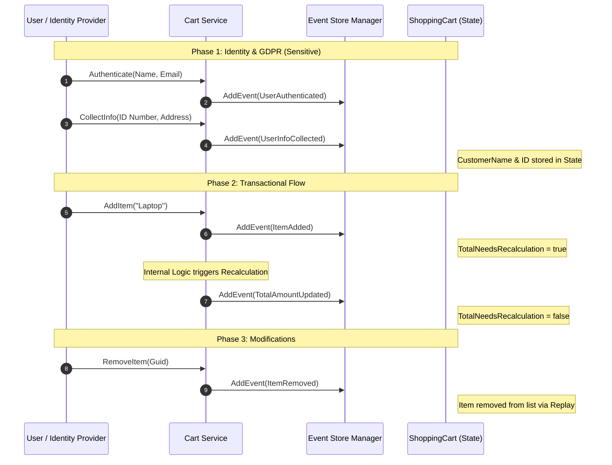

# PoC 1: Advanced Event Sourced Shopping Cart

### The Concept: Complex Domain & Data Privacy
This stage establishes a production-grade domain model. We move beyond simple state changes to handle complex lists and **GDPR-sensitive data classification**.

### 🛡️ Data Classification & GDPR
To ensure global compliance, the events are categorized by their data sensitivity:

1.  **Identity Domain:** Contains PII (Personally Identifiable Information) like Names and Social Security Numbers.
2.  **Transactional Domain:** Contains business facts like order items and totals.

In a future "Surgical Pruning" scenario, the Identity events can be scrubbed or anonymized without breaking the transactional history of the cart.

### 🏗 Layered Architecture
| Layer | Responsibility |
| :--- | :--- |
| **Domain (Events)** | Categorized into Identity and Transactional streams. |
| **Domain (State)** | Tracks `TotalNeedsRecalculation` to decouple item logic from financial logic. |
| **Infrastructure** | Performs the Replay. Reconstructs state from the full event history. |
| **Business Logic** | Orchestrates events, ensuring that sensitive info is captured early in the flow. |

---

### 🔄 Business Flow: Decoupled Calculations
Instead of updating the total price automatically inside an "AddItem" event, we follow the best practice of emitting a separate `TotalAmountUpdated` event. This allows for complex tax/shipping logic to occur outside the core event storage.

