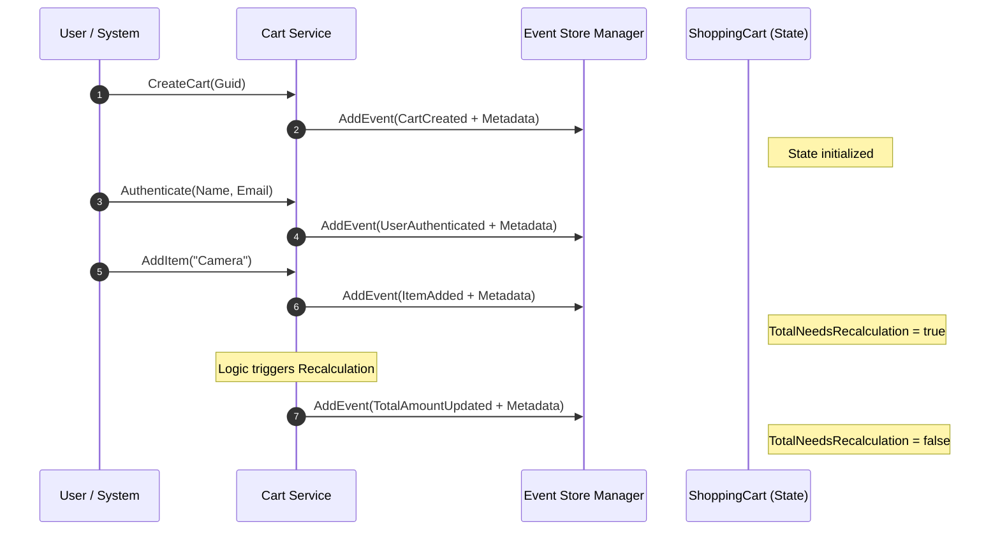

# PoC 1: Basic Event Sourcing (Lean Architecture)

This project demonstrates the core principles of Event Sourcing with a focus on **pure business data**. It establishes a "Replay-only" pattern where the application state is reconstructed from a chronological log of immutable events.

## Architectural Focus: Separation of Concerns
To keep the domain model as lean as possible, we distinguish between **Business Data** and **Traceability Metadata**:

* **Business Data (Event Payload):** Contains only what is necessary for the domain logic (e.g., `Price`, `Quantity`, `ProductID`).
* **Metadata (Event Header):** Contains cross-cutting information like `CorrelationId`, `CausalityId`, and an optional `UserId` for audit trails. This ensures the domain logic isn't cluttered with "dead weight" data.

## Key Features
* **Audit-Ready:** Traceability is built into the metadata from day one.
* **Pure Domain Events:** Events represent business facts, not database rows.
* **State via Replay:** State is calculated on-the-fly by replaying the event stream ($O(n)$ complexity).

## Business Data Overview
| Event | Core Data Points |
| :--- | :--- |
| **CartCreated** | Cart ID |
| **UserAuthenticated** | External Identity ID, Full Name, Email |
| **ItemAdded** | Product ID, Quantity, Price |
| **TotalAmountUpdated** | New Total, Reason |

## Flow Visualization

```mermaid
sequenceDiagram
    autonumber
    participant U as User / System
    participant S as Cart Service
    participant M as Event Store Manager
    participant St as ShoppingCart (State)

    U->>S: CreateCart(Guid)
    S->>M: AddEvent(CartCreated + Metadata)
    Note right of St: State initialized

    U->>S: Authenticate(Name, Email)
    S->>M: AddEvent(UserAuthenticated + Metadata)
    
    U->>S: AddItem("Camera")
    S->>M: AddEvent(ItemAdded + Metadata)
    Note right of St: TotalNeedsRecalculation = true
    
    Note over S: Logic triggers Recalculation
    S->>M: AddEvent(TotalAmountUpdated + Metadata)
    Note right of St: TotalNeedsRecalculation = false
```