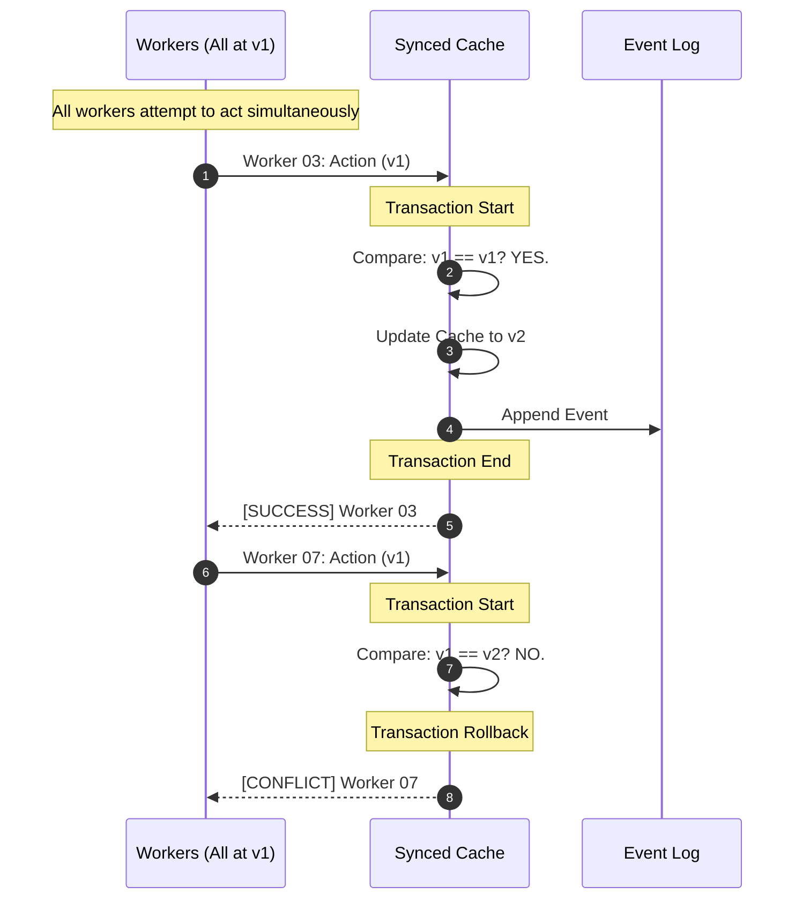

# PoC 2: Synced Cache Sourcing (The Transparent Race)

This project demonstrates the **Sync-Sourcing Engine**'s ability to handle high-concurrency collisions using a thread-safe, memory-resident state cache.

## The Strategy: Optimistic Concurrency Control (OCC)
The core innovation is the transition from replaying history to **guarded state updates**.

### 1. The Version Check (Logical Guard)
Every command sent by a worker includes an `ExpectedVersion`. This is **Optimistic Concurrency**. The system only allows the change if the user is acting upon the most recent version of the truth.

### 2. The Atomic Sync (Technical Guard)
In this in-memory PoC, we use a programmatic lock to ensure that the "Check Version -> Update Cache -> Append Log" sequence is **atomic**. In a persistent production environment (like PoC 3), this atomicity is handled by the database's transaction engine.

## The Grand Prix Simulation
The demo simulates **10 concurrent workers** attempting to modify a Shopping Cart, all starting from the same initial state (Version 1).

### Expected Trace:
* **The Winner:** The first worker to reach the engine finds that `ExpectedVersion (1) == CacheVersion (1)`. The update succeeds and the cache moves to Version 2.
* **The Followers:** All subsequent workers fail. Even though they "thought" they had the right version, the engine detects that the state has moved on.

