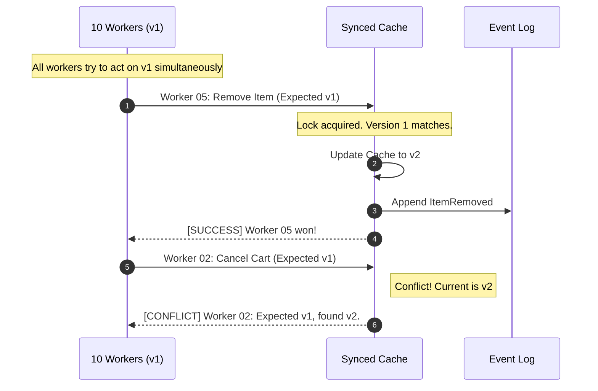

# PoC 2: Synced Cache Sourcing (The Transparent Race)

This project demonstrates the **Sync-Sourcing Engine**'s ability to handle high-concurrency collisions using a thread-safe, memory-resident state cache.

## The Strategy: Atomic Guarding
The core of this PoC is the `TryAddEvent` method. It acts as a gatekeeper that ensures only the first worker to arrive with the correct version can modify the state.

### Key Logic:
1. **Action Intent:** Workers declare exactly what they intend to do (`RemoveItem` or `CancelCart`).
2. **Version Lock:** The system checks the `ExpectedVersion` against the `CacheVersion` inside a synchronous lock.
3. **Instant Feedback:** Conflicts are returned as messages rather than exceptions, keeping the demo fast and readable.

## The Grand Prix Output
The console demo follows three distinct phases:

1. **The Setup:** A Shopping Cart is initialized to Version 1 with a single item.
2. **The Collision:** 10 concurrent workers attempt to modify the cart, all believing the version is still 1.
3. **The Audit:** The system displays the final state, proving that only the winning action was persisted.

