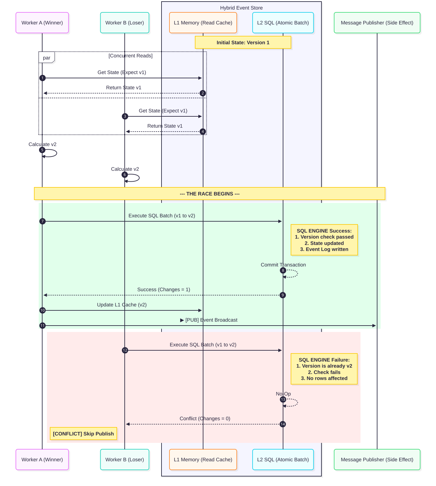
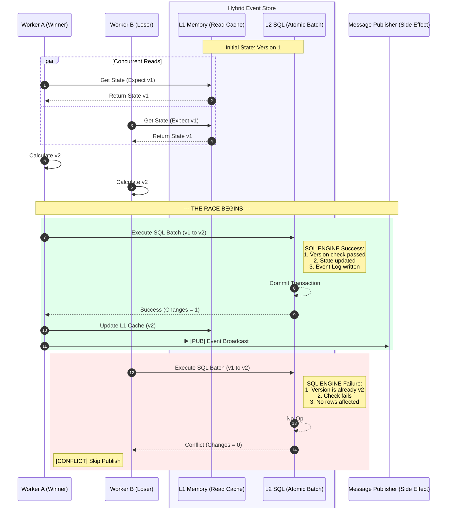

# PoC 3: Hybrid Memory-Persistent Sourcing
This project demonstrates a high-performance **Shadow-Persistence** model. It combines the ultra-low latency of PoC 2 with the robust durability of PoC 3.

## The Strategy: L1/L2 Hybrid
In this architecture, the **In-Memory Cache (L1)** acts as the primary gatekeeper for concurrency, while the **SQL Database (L2)** acts as a persistent shadow.

### How it Works:
1. **L1 Read-Through:** The system always checks the memory cache first. On a miss, it hydrates the cache from the SQL "Shadow Cache."
2. **Memory Gatekeeping:** All version checks happen instantly in memory, providing sub-millisecond validation.
3. **Atomic Shadowing:** Upon a valid memory update, the system performs a single-roundtrip batch update to SQL. The DB only accepts the change if its version matches the L1 state, ensuring total consistency.

## Key Benefits
* **Scalability:** Enables sharding across multiple event managers.
* **Low Latency:** 99% of read/validation operations happen in memory.
* **Resilience:** If the memory cache is cleared, it is perfectly reconstructed from the SQL shadow.

View Mermaid Source Code

